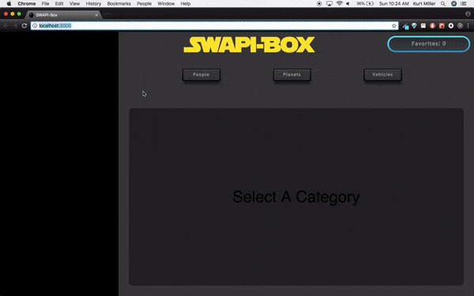

# SWAPI-box

This project utilized the Star Wars API (SWAPI) to fetch and display Star Wars data.

## Starting the Application:

Clone down this repo

Run npm install

Run npm start

# SWAPI-box in action:

Group Members: [Ben Paige](https://github.com/benjaminpaige), [Kurt Miller](https://github.com/kmiller9393)

This project was bootstrapped with [Create React App](https://github.com/facebookincubator/create-react-app).
