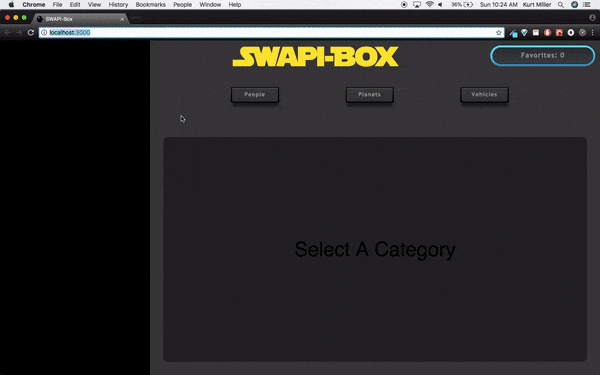
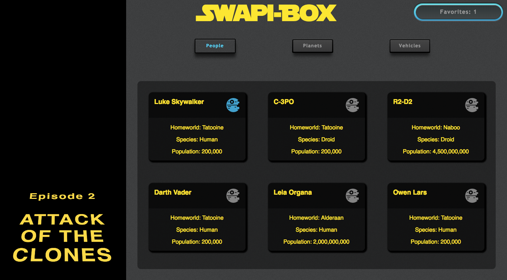

# SWAPI-Box

SWAPI-Box is an application that uses the Star Wars API (SWAPI) to display information about various people, planets and vehicles that can be found in Star Wars. Users can store different options within their favorites section to view them later on. This application was built with React.js, React Router and SASS and tested with Jest and Enzyme.

### [View Deployed Application](https://star-wars-api-km.herokuapp.com/)

## Starting the Application Locally:

1. Clone down this repository.

2. `cd` into the `swapibox` directory.

3. Run `npm install`.

4. Run `npm start`.

# SWAPI-box in action:

# HomePage

Group Members: [Ben Paige](https://github.com/benjaminpaige), [Kurt Miller](https://github.com/kmiller9393)
